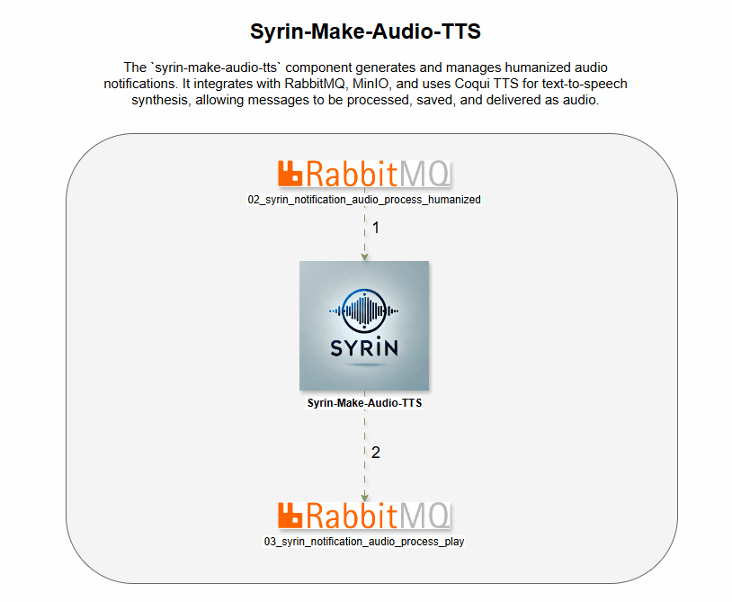

# syrin-make-audio-tts

O componente `syrin-make-audio-tts` gera e gerencia notificações de áudio humanizadas. Ele integra-se com RabbitMQ, MinIO e usa o Coqui TTS para síntese de texto para fala, permitindo que as mensagens sejam processadas, salvas e entregues como áudio.

## Demo

## Tabela de Conteúdos
- [Instalação](#instalação)
- [Variáveis de Ambiente](#variáveis-de-ambiente)
- [Funcionalidade](#funcionalidade)
- [Declarações de Filas](#declarações-de-filas)
- [Logs](#logs)
- [Licença](#licença)

## Instalação

Certifique-se de que o RabbitMQ, MinIO e Coqui TTS estejam configurados e acessíveis. Para detalhes completos de instalação, consulte o [Repositório de Instalação do SYRIN](https://github.com/syrin-alert/syrin-install).

## Variáveis de Ambiente

Defina as seguintes variáveis de ambiente para configurar RabbitMQ, MinIO e TTS:

### Configurações do RabbitMQ

- `RABBITMQ_HOST`: Endereço do servidor RabbitMQ.
- `RABBITMQ_PORT`: Porta para o servidor RabbitMQ (padrão: `5672`).
- `RABBITMQ_VHOST`: Virtual host no RabbitMQ.
- `RABBITMQ_USER`: Nome de usuário para autenticação no RabbitMQ.
- `RABBITMQ_PASS`: Senha para autenticação no RabbitMQ.
- `RABBITMQ_TTL_DLX`: Tempo de vida em ms para a fila de dead-letter (padrão: `60000`).

### Configurações do MinIO

- `MINIO_URL`: URL do servidor MinIO.
- `MINIO_PORT`: Porta para o servidor MinIO (padrão: `9000`).
- `MINIO_ROOT_USER`: Nome de usuário para autenticação no MinIO.
- `MINIO_ROOT_PASSWORD`: Senha para autenticação no MinIO.
- `MINIO_BUCKET_WORK`: Nome do bucket para armazenar arquivos de áudio.

### Configurações do TTS

- `TTS_LANGUAGE`: Idioma para síntese de TTS (padrão: `pt-br`).
- `TTS_EMOTION`: Emoção para o áudio gerado pelo TTS (ex.: "happy", "neutral").
- `TTS_SPEED_VOICE`: Ajuste de velocidade para a voz do TTS (ex.: 0.8 ou 1.1).
- `TTS_PATH_CLONE_AUDIO`: Caminho para o áudio de referência para clonagem de voz.
- `TTS_MODEL`: Nome do modelo para o Coqui TTS (padrão: `tts_models/multilingual/multi-dataset/your_tts`).

## Funcionalidade

Este script executa as seguintes tarefas:

1. Conecta-se ao RabbitMQ, MinIO e Coqui TTS com as configurações fornecidas nas variáveis de ambiente.
2. Processa mensagens das filas, gera áudio humanizado usando o TTS e faz upload dos arquivos para o MinIO.
3. Redireciona mensagens para reprodução ou reprocessamento, dependendo do sucesso ou falha das operações.

### Declarações de Filas

As seguintes filas são gerenciadas no RabbitMQ:

- `02_syrin_notification_audio_process_humanized`: Processa notificações de áudio humanizadas.
- `02_syrin_notification_audio_reprocess_humanized`: Gerencia reprocessamento para notificações falhadas.
- `03_syrin_notification_audio_process_play`: Envia notificações processadas para reprodução de áudio.

## Logs

Os logs estão configurados no nível INFO e os logs da biblioteca `pika` são definidos para WARNING para reduzir a verbosidade.

## Licença

Este projeto está licenciado sob a Licença MIT.